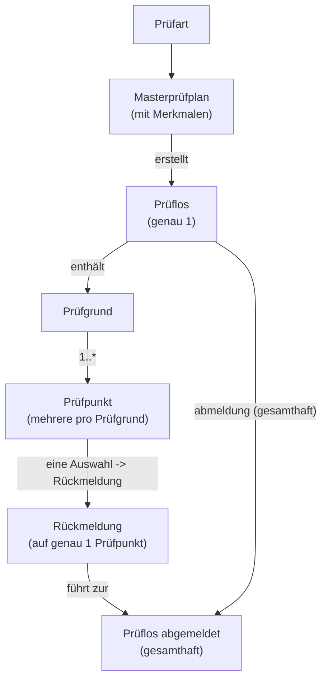

```mermaid
graph TD
  A["Prüfart"]
  B["Masterprüfplan<br/> (mit Merkmalen)"]
  C["Prüflos<br/> (genau 1)"]
  D["Prüfgrund"]
  E["Prüfpunkt<br/> (mehrere pro Prüfgrund)"]
  F["Rückmeldung<br/> (auf genau 1 Prüfpunkt)"]
  G["Prüflos abgemeldet<br/> (gesamthaft)"]

  A --> B
  B -->|"erstellt"| C
  C -->|"enthält"| D
  D -->|"1..*"| E
  E -->|"eine Auswahl -> Rückmeldung"| F
  F -->|"führt zur"| G
  C -->|"abmeldung (gesamthaft)"| G
```